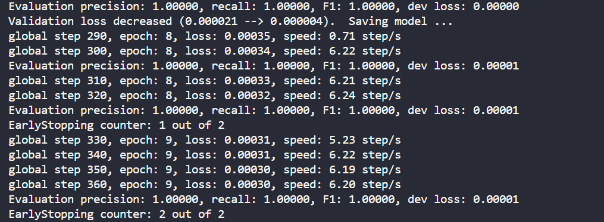

# UIE PyTorch
  
[](LICENSE)  
  
[](requirements.txt)  

## Introduction
基于UIE(Universal Information Extraction)方法的通用信息抽取工具训练预测项目，项目支持UIE模型的自动下载和torch及onnx模型的转换。支持UIE通用抽取模型和情感抽取模型，该项目支持加载torch和onnx模型文件进行预测，不支持paddle模型直接预测。

## Updates
日期       | 版本     |描述
:--------- |:--------|---
2023-03-03 | v1.0.0  |初始仓库

## Requirement
几个重要环境：
* python：3.10+  
* torch：2.0.1+  
其它环境见requirements.txt  

## Feature
支持[UIE](https://arxiv.org/pdf/2203.12277.pdf)模型结构的微调、预测和模型转换。

### UIE
UIE相关的模型可以直接通过本项目下载，请在config.py中配置的model_type直接指定：
Model              |        Structure         | 
:------------------|--------------------------|
uie-base           | 12L768H                  |
uie-medium         | 6L768H                   |
uie-mini           | 6L384H                   |
uie-micro          | 4L384H                   |
uie-nano           | 4L312H                   |

### UIE-senta
UIE情感抽取的模型不支持直接下载，需要自己下载原始的paddle格式模型然后启动该项目转换。  
Model                                                                   | Structure         | 
:-----------------------------------------------------------------------|-------------------|
[uie-senta-base](https://huggingface.co/PaddlePaddle/uie-senta-base)    | 12L768H           |
[uie-senta-medium](https://huggingface.co/PaddlePaddle/uie-senta-medium)| 6L768H            |
[uie-senta-mini](https://huggingface.co/PaddlePaddle/uie-senta-mini)    | 6L384H            |
[uie-senta-micro](https://huggingface.co/PaddlePaddle/uie-senta-micro)  | 4L384H            |
[uie-senta-nano](https://huggingface.co/PaddlePaddle/uie-senta-nano)    | 4L312H            |

## Mode  

项目提供了四种模式，如下： 

Mode               |       Detail              | 
:------------------|---------------------------|
train              | 训练UIE                   |
interactive_predict| 交互预测模式               |
test               | 跑测试集                   |
export_torch       | 将paddle模型保存torch模型  |
export_onnx        | 将torch模型保存未onnx模型  |

## Getting start
项目只需要在config.py中配置好所有策略，然后点击main.py即可运行，没有其他的入口。

### Train  
训练前请将paddle模型转化为torch模型，demo的数据已经转换好放到了datasets下面，请自行准备和转换数据，config文件配置如下： 
```
mode = 'train'

# 使用GPU设备
use_cuda = True
cuda_device = 0

show_bar = True

configure = {
    # prompt schema
    'schema': ['出发地', '目的地', '费用', '时间'],
    'model_type': 'uie-base',
    # 训练数据集
    'train_file': 'datasets/train.txt',
    # 验证数据集
    'val_file': 'datasets/dev.txt',
    # 测试数据集
    'test_file': 'datasets/dev.txt',
    # 引擎onnx或者pytorch
    'engine': 'pytorch',
    # 模型语言
    'schema_lang': 'zh'
}
```
点击main.py即可运行训练，训练完后请修改checkpoints_dir路径为训练模型保存的路径（如果有训练的模型，程序会优先读取训练的模型），通过下面Interactive Predict的配置方法可以对训练的模型进行预测检验效果。 



### Interactive Predict
预测前请将paddle模型转化为torch模型或者onnx模型。  
config文件配置如下： 
```
mode = 'interactive_predict'

# 使用GPU设备
use_cuda = True
cuda_device = 0

show_bar = True

configure = {
    # prompt schema
    'schema': ['出发地', '目的地', '费用', '时间'],
    'model_type': 'uie-base',
    # 训练数据集
    'train_file': 'datasets/train.txt',
    # 验证数据集
    'val_file': 'datasets/dev.txt',
    # 测试数据集
    'test_file': 'datasets/dev.txt',
    # 引擎onnx或者pytorch
    'engine': 'pytorch',
    # 模型语言
    'schema_lang': 'zh'
}
```
预测的结果如下：
```
please input a sentence (enter [exit] to exit.)
城市内交通费7月5日金额114广州至佛山
[{'出发地': [{'end': 17,
           'probability': 0.9990670447616274,
           'start': 15,
           'text': '广州'}],
  '时间': [{'end': 10,
          'probability': 0.9998391927987882,
          'start': 6,
          'text': '7月5日'}],
  '目的地': [{'end': 20,
           'probability': 0.9991354583582108,
           'start': 18,
           'text': '佛山'}],
  '费用': [{'end': 15,
          'probability': 0.9989813726060746,
          'start': 12,
          'text': '114'}]}]
time consumption: 60.676(ms)
```

### Others
除了训练和交互预测外，还可以通过修改mode来跑测试集，或者进行onnx模型的转换。  

## Reference  
[通用信息抽取 UIE(Universal Information Extraction)](https://github.com/PaddlePaddle/PaddleNLP/tree/develop/model_zoo/uie)  
[通用情感信息抽取](https://github.com/PaddlePaddle/PaddleNLP/tree/develop/applications/sentiment_analysis/unified_sentiment_extraction)  
[通用信息抽取 UIE(Universal Information Extraction) PyTorch版](https://github.com/HUSTAI/uie_pytorch)  

## License
UIE模型版权归百度所有。该项目采用Apache 2.0 license开源许可证。  
